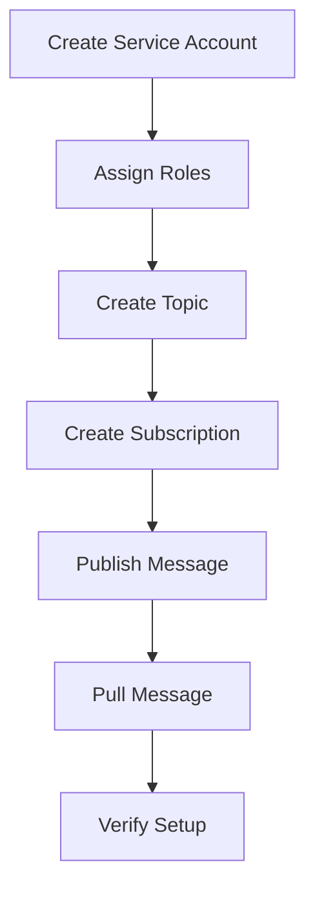

## 🚀 **Google Cloud Pub/Sub Setup Guide**  

This guide will walk you through setting up Google Cloud Pub/Sub step-by-step, including creating a service account, assigning roles, creating a topic, publishing messages, subscribing to them, and verifying the setup. A flowchart is also included to visualize the process.

---

## 🌟 **Step 1: Create a Service Account**
1. Open your terminal.
2. Run the following command to create a service account:

```bash
gcloud iam service-accounts create pubsub-sa \
    --display-name "Pub/Sub Service Account"
```

✅ **Expected Output:**  
- A confirmation message will appear showing that the service account was created.

---

## 🌟 **Step 2: Get the Service Account Email**
List all service accounts to retrieve the email of the one you just created:

```bash
gcloud iam service-accounts list
```

✅ **Expected Output:**  
- A table displaying the service account's email, unique ID, and description.  

Example:
```text
NAME         EMAIL                                 DISABLED
pubsub-sa    pubsub-sa@your-project-id.iam.gserviceaccount.com  False
```

---

## 🌟 **Step 3: Assign Roles to the Service Account**
You need to assign permissions to the service account for Pub/Sub.

### 👉 **For Publishing**  
Assign the `pubsub.publisher` role:  

```bash
gcloud projects add-iam-policy-binding [PROJECT_ID] \
    --member="serviceAccount:[SERVICE_ACCOUNT_EMAIL]" \
    --role="roles/pubsub.publisher"
```

### 👉 **For Subscribing**  
Assign the `pubsub.subscriber` role:

```bash
gcloud projects add-iam-policy-binding [PROJECT_ID] \
    --member="serviceAccount:[SERVICE_ACCOUNT_EMAIL]" \
    --role="roles/pubsub.subscriber"
```

### 👉 **For Full Admin Control**  
(If needed for managing topics, subscriptions, and permissions):

```bash
gcloud projects add-iam-policy-binding [PROJECT_ID] \
    --member="serviceAccount:[SERVICE_ACCOUNT_EMAIL]" \
    --role="roles/pubsub.admin"
```

✅ **Expected Output:**  
- A message confirming the IAM policy update.

Example:
```text
Updated IAM policy for project [devops01-450518].
bindings:
- members:
  - serviceAccount:pubsub-sa@your-project-id.iam.gserviceaccount.com
  role: roles/pubsub.admin
etag: BwYv0gyiths=
version: 1
```

---

## 🌟 **Step 4: Create a Pub/Sub Topic**
Create a new topic where messages will be published:

```bash
gcloud pubsub topics create my-topic
```

✅ **Expected Output:**  
- A confirmation message showing the topic was created.

Example:
```text
Created topic [projects/your-project-id/topics/my-topic].
```

---

## 🌟 **Step 5: Publish a Message to the Topic**
Send a message to the topic:

```bash
gcloud pubsub topics publish my-topic --message "Hello, Pub/Sub!"
```

✅ **Expected Output:**  
- A confirmation message showing the message was published.

Example:
```text
Message published.
```

---

## 🌟 **Step 6: Create a Subscription**
Create a subscription to receive messages from the topic:

```bash
gcloud pubsub subscriptions create my-subscription \
    --topic=my-topic
```

✅ **Expected Output:**  
- A confirmation message showing the subscription was created.

Example:
```text
Created subscription [projects/your-project-id/subscriptions/my-subscription].
```

---

## 🌟 **Step 7: Pull Messages from the Subscription**
Retrieve messages from the subscription:

```bash
gcloud pubsub subscriptions pull my-subscription --auto-ack
```

✅ **Expected Output:**  
- The message content will be displayed in the terminal.

Example:
```text
Received message: ID=123456789123456789
Data: 'Hello, Pub/Sub!'
```

---

## 🌟 **Step 8: Verify the Setup**
To verify the roles and permissions:

```bash
gcloud projects get-iam-policy [PROJECT_ID]
```

✅ **Expected Output:**  
- A list showing the assigned roles to the service account.

Example:
```text
bindings:
- members:
  - serviceAccount:pubsub-sa@your-project-id.iam.gserviceaccount.com
  role: roles/pubsub.publisher
- members:
  - serviceAccount:pubsub-sa@your-project-id.iam.gserviceaccount.com
  role: roles/pubsub.subscriber
```

---

## 🔥 **Flowchart: How Pub/Sub Works**  
Here’s how the entire process works:  

1. Create a **Service Account**.  
2. Assign **Roles** (Publisher/Subscriber/Admin).  
3. Create a **Topic**.  
4. Create a **Subscription** linked to the topic.  
5. **Publish Messages** to the topic.  
6. **Pull Messages** from the subscription.  
7. Verify the setup and roles.  

---



---


